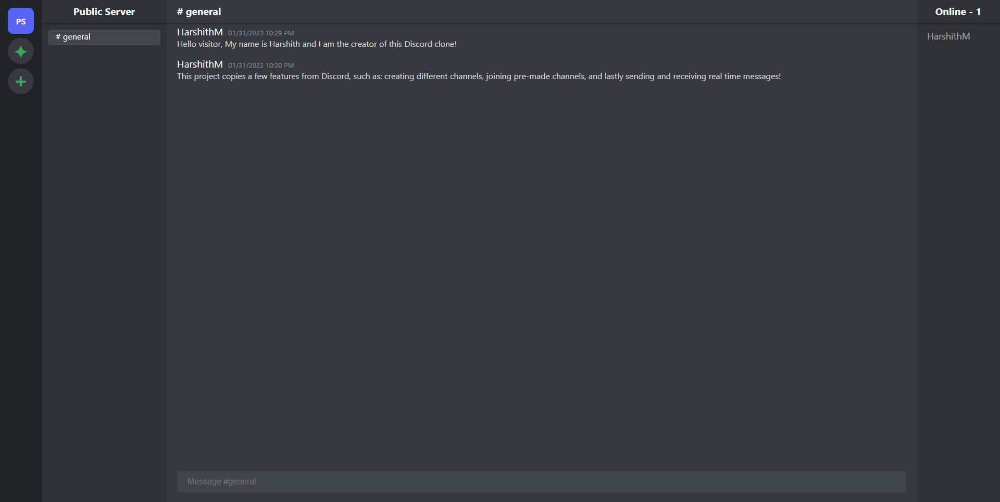

# Discord-Clone

A full stack project that clones key features of the popular messaging app Discord. Created using React front-end and mongodb backend. Encorporates websockets to relay real time messages from client to client. Key features include the abilities to: create different channels, join pre-made channels, and send and receive real time messages!

## Deployed Link

[https://hmanjun.github.io/Discord-Clone/#/register](https://hmanjun.github.io/Discord-Clone/#/register)

## Installation

Clone down the repo or download the repo.

Install the required packages by running:
```
npm install
```
This will install both the required packages for the client and server.

Then run the client and server by running:
```
npm start
```

## Aplication Preview



## Technology Used

- Git
- JavaScript
- Node
- Bcrypt
- Dotenv
- MongoDB
- Mongoose
- React
- JSON Web Tokens
- WebSocket

## License
[](https://opensource.org/licenses/MIT) 

Licensed under the [MIT](https://opensource.org/licenses/MIT) license

## Questions
Contact me via email at hmanjuna@ucsc.edu
View my other projects on [github](github.com/hmanjun) 